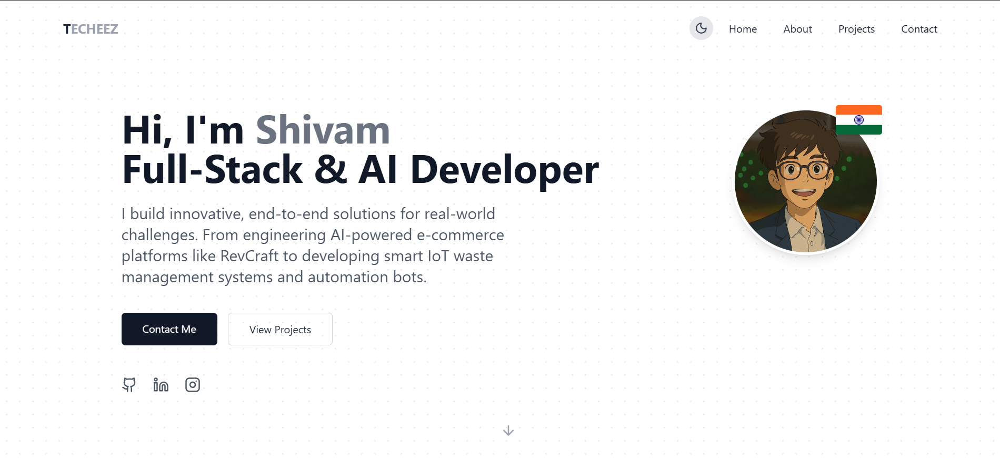

# 👾 PORTFOLIO.EXE

Welcome to **PORTFOLIO.EXE** — my retro, RPG, and terminal-inspired personal portfolio. I built this to showcase my projects, skills, and achievements in a fun, game-like interface instead of a standard website.



🔗 **Live Demo**: (https://shivam-kushwaha.netlify.app/)

---

## 🎮 Features

- **Retro Aesthetic**: Pixel fonts, CRT scanlines, and terminal styling.
- **Parallax Background**: Interactive, multi-layered star field that reacts to mouse movement.
- **Game-Like UI**: RPG-style character stats, quest logs (education), and inventory (skills).
- **Sound Effects**: Zero-latency interactive UI sounds on hover and click (can be muted).
- **Responsive HUD**: A dynamic navbar that hides when scrolling down and reappears when scrolling up.
- **Elite Achievements**: Tiered achievement cards with unique hover glows (Legendary, Elite, etc.).

---

## 🛠️ Tech Stack

- **Framework**: [React](https://reactjs.org/) + [Vite](https://vitejs.dev/)
- **Styling**: [Tailwind CSS](https://tailwindcss.com/) + Custom CSS for pixel-art effects
- **Icons**: [Lucide React](https://lucide.dev/)
- **Deployment**: Netlify

---

## 🚀 Running Locally

Want to explore the code or run it on your own machine?

1. **Clone the repository**
   ```bash
   git clone https://github.com/Shivam-0512/MyPortfolio.git
   cd MyPortfolio
   ```

2. **Install dependencies**
   ```bash
   npm install
   ```

3. **Start the development server**
   ```bash
   npm run dev
   ```

4. Open `http://localhost:5173` in your browser.

---

## 👤 About Me

I'm **Shivam Kushwaha**, a 4th-year CSE student specializing in **Full-Stack Development, AI, and IoT**. I focus on building real-world, scalable systems — turning ideas into working products.

### 🏆 Notable Achievements
- **National Level Finalist**: Top 10 at Techfest IIT Bombay 2024 (MailExtracto Automation Bot).
- **Best Hardware Solution**: HackDiwas 2026 Grand Finale (Arohan).
- **Hackathon Veteran**: Participated in 7+ Hackathons across various domains.

---

## 📝 License

This project is open-source and available under the [MIT License](LICENSE). Feel free to use it as inspiration for your own portfolio!

<p align="center">
  <i>Made with ♥ by Shivam.exe</i>
</p>
